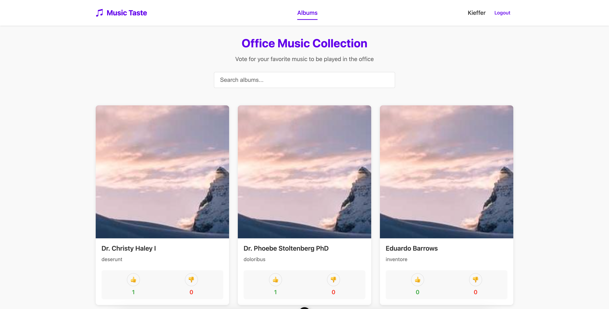

# music-taste-frontend

Frontend for voting albums for office music playlist


## Environment Variables

To run this project, you will need to add the following environment variables to your .env file

`VITE_API_URL=http://your-project.url/api`

## Project Setup

```sh
npm install
```

### Compile and Hot-Reload for Development

```sh
npm run dev
```

### Type-Check, Compile and Minify for Production

```sh
npm run build
```

## Screenshots



## Authors

- [@kiefferganza](https://www.github.com/kiefferganza)

